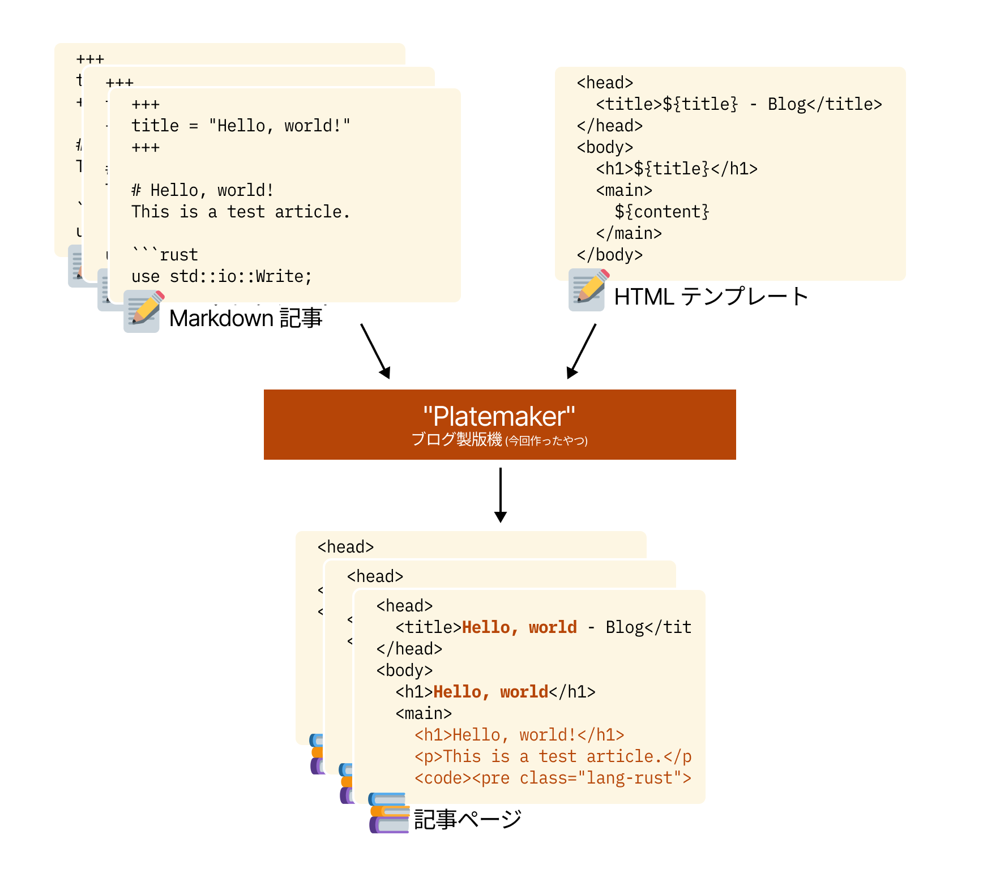
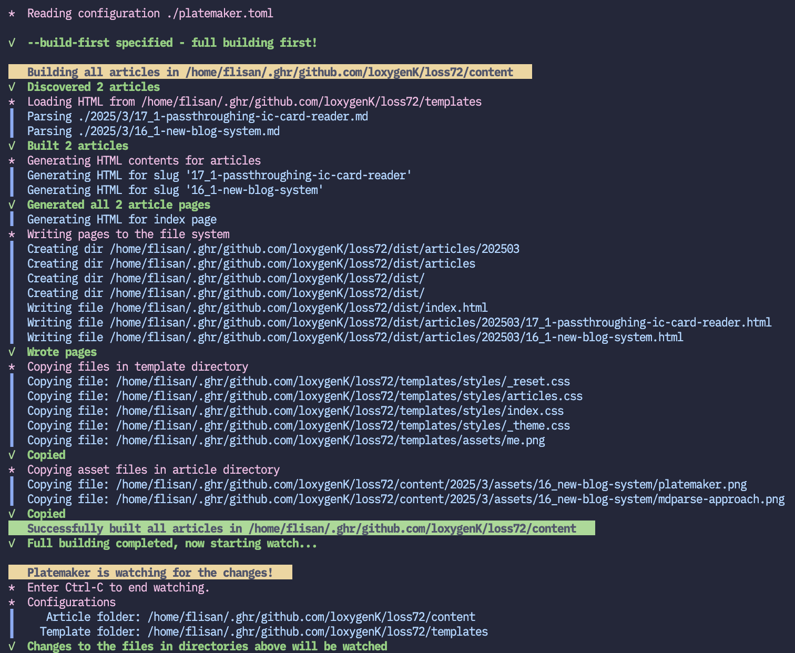
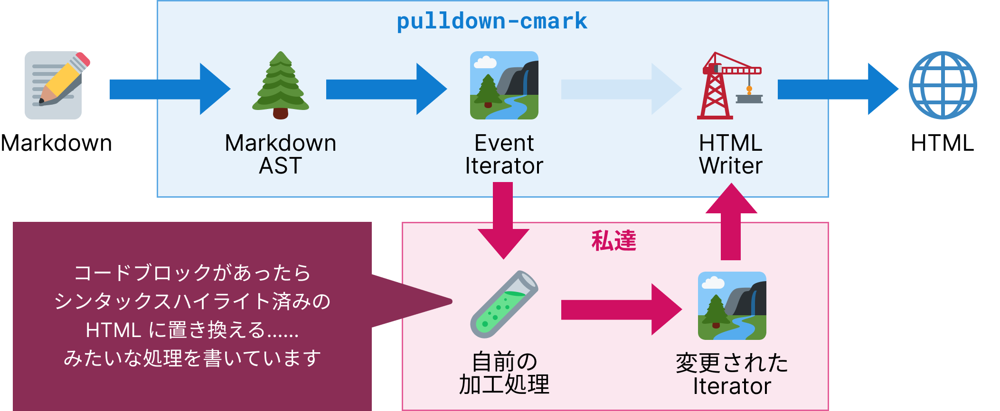

+++
title = "Rust でブログサイトのジェネレータを作ってみました"
brief = """
<code>pulldown-cmark</code> などを使って、Rust でブログサイトジェネレータを作ってみました。
クライアントでもサーバでも JavaScript は使いませんでした。
拡張性もあり、欲しい機能もつけることができ、爆速だしちゃんと動くしで、いいものを作ることができました。
"""

[widgets]
ai = "Unused"
article_type = "Activity"
+++

フライさんです。新しくブログサイトを作ってみました!

普段 Web サイトを作るときは、もちろん JavaScript / TypeScript にすごいお世話になるのですが、
**今回は JavaScript を使わず**、Rust で HTML/CSS を生成する形で Web サイトを作っています

今回は、このブログの技術的側面についてご紹介したいと思います。


# 今回のブログサイトの概要

なんで新しく生やしたかとか、そういう話の前に、どういう構成でこのブログサイトができているのかをご紹介します。

今回作成したブログサイトジェネレータ (Platemaker) は、
**記事ページ用・記事一覧ページの HTML テンプレート**と
**Markdown 記事**
を取り、Markdown 記事の内容を HTML テンプレートに当てはめることでサイトを生成します[^low-design-knowledge]。図みたいな感じです ↓



ちなみに本題には全く関係ないですが、生成時はこういう最高のログが表示されます。



[^low-design-knowledge]: サイトのデザインに関しては HTML テンプレートに書くようにしているので、Platemaker 側では
強くは関与していません。やっている仕事はテンプレートに当てはめるだけなので、テンプレートを差し替えれば
好きなレイアウトのサイトを作ることができるようになっています!

# 前のブログサイトで感じていたつらみ

もし覚えている方がいたら「なんで！？！」という感じなのですが、私はすでにブログサイトを持っています。
ただ、このブログサイトにはいくつかつらみがありました。

- **必要以上に要件を設定してしまった / 変にこだわってしまった**<br>
  MDX 対応とか、別に使わんやろ〜〜みたいな機能に対応させてしまいました（実際使わなかった）。
  ただの Markdown なら良かったんですが、これの対応が結構たいへんで、
  多くの依存やコードベースの拡大につながってしまいました。

- **コードベースがやけに複雑になってしまった**<br>
  主に ↑ が理由ではあるのですが、コードベースがデカいです。
  あと私がまともに関心を分けれず、変更しようと思ったときに、どこを変更すればいいのか
  しばらくコードベースを見てもわからず、つらみが大きかったです。
  それと、Pages Router 時代の Next.js を使っていたので、SSR のために必要なコードがちらほらあり、
  私があまり Pages Router での SSR に対するリテラシーがないというのもあって、SSR のためのコードで
  コードベースが大きくなる、ということもありました。

- **拡張/変更に弱い**<br>
  ↑ でも書きましたが、コードベースが複雑だし関心を分けれてないしで、拡張/変更に弱いコードに
  なってしまいました。どこを変えたらどこが変わるのかがぱっと見でよくわかりません。
  変更しようとコードベースを見るとすげえでかい関数が鎮座してて心が折れます。
  
- **微妙に完成していない機能がある**<br>
  ↑ を理由として、コア機能以外は不完全な出来になっていました。
  一番きつかったのが、**Hot reload が上手く効かない**という点でした。
  記事を更新するたびに Dev Server の再起動が必要になるので、これは結構きつかったです。

結構ボロクソに書いてしまいましたが、もちろん良かった点もあります!
**MDX 機能はあらかたちゃんと動いていました**し、デザインも作りたいものを実装できていました。

ただ、記事を書くときのつらみがどうしても大きく、それがモチベを引き下げてしまって、
せっかくブログサイトを作ったのに記事を書かない…… ということになってしまいました。

# 技術選定について

先にも書きましたが、今回は **JavaScript はなし、Rust に HTML/CSS を全部生成させる** という方法でやりました。

## JavaScript いらなくね?

ブログサイトというのは、**事前定義されたコンテンツを HTML/CSS に起こして閲覧できればそれで耐える**
ので、クライアント側で必要な処理というのは極めて少ないです。
Clickable なものといえばハイパーリンクくらいです。

これであれば、**クライアント側で JavaScript を使う必要は実はなさそう**です。
MDX に関しても、前のブログサイトでそれなりに痛い目を見たので対応しない方針で行こうと決めていたので、
なお JavaScript いらないのでは？と感じました。

また、「クライアント側で JavaScript がいらないなら、サーバ側を JavaScript で書く意味もなさそうです。
バックエンド側はかなり選択肢が広いですし、わざわざ JS を選ばなくても、別の言語を選んで良いように感じます。

**これらの理由から、JavaScript は今回は使わない**という決定をしました。
このサイトは JavaScript が無効になっていても完璧に動作します! :running:

## Rust で一つでかいのを書きたかった

**私は Rust が好きです！** 好きな理由をオタク語りできる、数少ないものの一つです。

**Rust を選んだ理由はほぼもうこれだけです。** あとは、Rust でなにか完成させたことが何かとない、
というのもひとつあります。

## 生の HTML/CSS でどこまで行けるか知りたかった

普段は JavaScript にお世話になり、動的に DOM をいじることで Web サイトを動かしていますが、
そういうのは全部抜きにして、ただの静的な HTML でどこまで作れるんだろうというのが気になっていた、
というのもありました。

今の CSS は、Variables ですとか、ネストですとか、強力な機能がたくさんあります。
ここまで環境が整っていれば、**実は CSS-in-JS とか CSS Preprocessor に頼らなくても
かなり書けるのでは?** という気持ちになりました。

# Platemaker の詳細

## 概要

大まかにはこういうフローで動いています。

1. 記事となる Markdown ファイルを列挙する。
2. テンプレートファイルを読み出す。
3. 各 Markdown から、メタデータと記事本文の HTML を生成する。
4. HTML テンプレートに、生成したメタデータと HTML を当てはめる。
5. 生成先ディレクトリに HTML を書き込み、CSS や画像などをコピーする。

<aside>
    それはそう…… というようなフローですが、特別喋ることがない…… というのは、
    それほど直感に沿ったシンプルな構造になっているということだとも思うので、
    良いことかなあと思います。
</aside>

### クレートの設計

処理のステップごとにコードベースをわかりやすく分けられそうだったので、クレートも区切って整理しています。こんな感じです:

```
bin  ............  CLI 周りのハンドリングと Watch 処理
crates/
    construct ...  ファイルを指定したディレクトリ構造で書き込み
    core  .......  全クレートで共通の構造体やログ処理等
    markdown  ...  Markdown のパース処理。ここが一番でかい
    template  ...  テンプレートへの値埋め込み処理の実装
    structure ...  パスを解析して、記事ファイル・月ごとのディレクトリ等の判別をする処理
    website  ....  Web サイトのディレクトリ構造を生成
    widgets  ....  Web サイトのメタデータに応じて動的に変えたい部分の実装
```

---

**以降は、Platemaker でどんな処理をしているか、大変だった部分について概要を紹介しようと思います。** それぞれ、気が向いたら詳細を記事に残すかもしれません。

## Markdown から HTML に起こす処理

Markdown から HTML に起こす処理については、[**`pulldown-cmark`**](https://github.com/pulldown-cmark/pulldown-cmark) クレートを使ってカスタマイズ・生成しています。

普通に Markdown から HTML に起こすだけであれば、[**`markdown`**](https://crates.io/crates/markdown/1.0.0-alpha.21) で足ります[^i-was-using-it]。ただ、このクレートの生成結果にはいくつか弱点が存在していました:

[^i-was-using-it]: というか最初はこっちを使っていました。ただ、シンタックスハイライト等の要件が増えて、`markdown` だと辛くなり乗り換えました、、

- **シンタックスハイライトができない**
- **絵文字がサポートされていない**

これらを自分で対応しようとすると、以下のようなアプローチになります:

- **生成結果の HTML か Markdown のテキストを文字列置換でいじる**<br>
  `:sparkles:` みたいな、「コードブロックの中の shortcode は置換しちゃだめ」みたいな処理を書くのがかなり大変になります。
- **Markdown/HTML の AST をいじる**<br>
  こっちであれば、文脈を考慮した編集がしやすくなるので、こっちでやりたいです!

ただ、このクレートでは Markdown の AST を得ること自体はできる一方で、
その AST を生成処理に使う…… というところまではできず、**Markdown/HTML の AST に手を加えて HTML を生成する**ということができません。

一方、`pulldown-cmark`[^realizing-pulldown-cmark-is-op] では、Markdown の AST を HTML 出力用に単純化・Flatten した enum "`Event`" の Iterator を得ることができます。HTML を生成するための関数に関しても、`impl Iterator<Item = Event>` を渡せばそれで良いので、Iterator を加工するだけで好きに生成結果をいじれるようになっています!

ただの `Event` の Iterator を受け取って加工して渡すだけでいいので、かなりシンプルなアーキテクチャで生成結果に手を加えることができます。



この手法が良さそうだったので、今回はその手法でやることにしました。

[^realizing-pulldown-cmark-is-op]: ちなみに、このクレートとアプローチは、この `markdown` クレート の Issue [(wooorm/markdown-rs#32)](https://github.com/wooorm/markdown-rs/issues/32#:~:text=I%20haven%27t%20played%20with%20trying%20to%20add%20this%20to%20markdown%2Drs%20yet%20(and%20don%27t%20know%20if/when%20I%27ll%20have%20time%20to)%2C%20but%20a%20design%20that%20I%20find%20quite%20powerful%20is%20the%20one%20exposed%20by%20pulldown%2Dcmark.) で知りました。

カスタマイズ用に自前で準備する Iterator は、ステートマシンのような挙動をするようにしています。もともとある Iterator から、「フロントマターはじめ」「フロントマター終わり」「コードブロックはじめ」「コードブロックおわり」みたいな、タグの開始/終了を示す Event が流れてくるので、それを見て自身のステートを変更して、生成結果をステートに応じて調整する…… ということをしています。

この加工処理によって、どのような機能を実装しているかを紹介します!

### シンタックスハイライトの実装

上の図でも述べましたが、<code>```</code> で囲まれているタイプのコードブロックが現れたら、シンタックスハイライト済み HTML を生成して、Event を差し替えるようにしています。
シンタックスハイライト済み HTML の生成には [`syntect`](https://github.com/trishume/syntect/tree/master) を使用しています。

<aside>

`syntect` というクレートはかなり便利で、**言語の名前やソースコードの拡張子からハイライト定義を探す**という機能はもちろん、**最初の 1 行や、トークンから探す**というメソッドもあります！また、HTML 専用のクレートというわけでもなくて、CUI に ANSI エスケープシーケンスで色をつけて、ハイライトされたソースコードを出力できるようにする…… という機能もあるみたいです。すごい

</aside>

### 絵文字 :sparkles: の適切なパース

`:sparkles:` :sparkles: みたいなやつのパースです。先にも書きましたが、単純な文字列置換ではなく、コードブロック内はパースしちゃいけない、、みたいな、コンテキストによる条件分けが必要なので、この Iterator の中でパース/置換処理を行っています。

`:emoji:` から Unicode を得る処理には `emojis` クレートを使っています。その後、`emojis` クレートから得た Unicode を元に、Twemoji の SVG への参照に変換しています。

### 途中で Markdown を改行した場合の処理

既定だと、文の途中で改行を入れると半角スペースが入ります。こういう感じで ↓

```markdown
例えば、
こういう
テキストは
こうなる
```

```c
"例えば、 こういう テキストは こうなる"
```

これは、英語とか、スペースで単語を区切る言語であれば適切な挙動なのですが、
日本語の場合はスペースで単語を区切らないので少し違和感があります。

このスペースは、`Event::Text(_)` の直後に来る `Event::SoftBreak` に対応して
生成されるので、`Event::Text(_)` の直後に `Event::SoftBreak` が来た場合、それは無視するようにしています。

この処理によって、Markdown 上では改行して行の文字数を抑えつつ、
ブログサイト上ではつながって表示されるので、日本語の文章*は*いい感じに表示されるようになりました![^english-is-compromised]

[^english-is-compromised]: yes, English sentence is compromised here.
With
out
the
careful
line
breaking
the
sentence
easily
combines
like
this.
It's
almost
a
meme.
I might fix this by detecting the previous text is ending in the alphabet so that
`Event::SoftBreak`s in English sentence don't get chomped off. But well... I'm a Japanese so that'll be later.

### 脚注処理

`markdown` クレートは脚注をめっっちゃいい感じにハンドリングしてくれます。
文章のどこに脚注の定義があっても、ちゃんとそれを最後の方に集約してくれます。
一方、`pulldown-cmark` は、パースはちゃんとしてくれても、HTML 生成にあたっては
そこまでしっかり面倒は見てくれません。なので、脚注生成処理に関しては自分で実装を行い、
ちゃんと集約するようにしました。

本文と脚注間のジャンプも含め、すべてを自分で実装することになったので、せっかくなのでいろいろやってみました。

- 脚注リンクの形式を `#n` にしてみました。
- 本文に戻ってくる際に、（画面上部の代わりに）ちゃんと画面中央に本文が戻ってくるようにしました。
- 脚注の内容を、出現場所に応じて並び替えるようにしています[^this-was-terrible]。
- `markdown` クレートによる生成結果では、脚注セクションは "Footnotes" という固定の文字列になっています。これでも全然いいのですが、せっかくなので日本語の「脚注」にしました。

[^this-was-terrible]: [この処理は書くのすげえ大変だったというか、コードベースが複雑になってしまいました。](https://github.com/loxygenK/loss72-platemaker/blob/4fc1a8dc233eb8286668b00877133f1165888197/crates/markdown/src/parse/sub_parser/footnote.rs#L24-L61)

**以上が、行っている加工処理の内容です！** 各処理ごとに関数をいい感じに分けれるようにしているので、拡張性も変更性も高いです。今後もいろいろな機能を追加していきます！

## Watch 処理

Markdown 記事が更新された際に、対応する HTML を更新するための処理をしています。すべての HTML を毎回再生成しているのではなく、特定の HTML だけを生成するようにしています！ここは、前ブログサイトでモチベが維持できない大きな原因だったのでこだわりました。

ファイルシステムの watch には、[**`notify`**](https://crates.io/crates/notify) クレートを使っています。
ただ、1 つの操作に見えても、ファイルシステム上では複数の操作が行われている……
みたいなことがあるようで、そのままだと大量のイベントが飛んできて処理が重複します。
これを防ぐために、[**`notify_debouncer_full`**](https://crates.io/crates/notify-debouncer-full) クレートで
イベントの debouncing をしています。

また、生成処理を終了できるように、<kbd>Ctrl+C</kbd> の受信が必要です。
<kbd>Ctrl+C</kbd> の受け付けには、[**`ctrlc`**](https://crates.io/crates/ctrlc) を使っています。

これらのクレートからのイベントはチャンネルで降ってきます。
各クレートからの Channel を select できるように、[**`crossbeam-channel`**](https://crates.io/crates/crossbeam-channel) を使っています。

<aside class="personal">

  こういう、チャンネルベースでのイベントハンドリングはやったことがなかったので新鮮でした。
  今回は `crossbeam-channel` にお世話になりましたが、もっといいやり方はあるかも

</aside>

## テンプレート補完処理

先述の通り、Markdown から HTML に起こす処理にあたっては、事前に用意したテンプレートにメタデータ等のデータを流し込んでいます。
画像でちらっと出しましたが、テンプレートには `${title}` という、JS/TS の String Interpolation と同じ形のプレースホルダーがあり、そこに文字列を流し込むようにしています。

このプレースホルダーを正規表現を使って実際のデータに置き換えることで、Web ページとして完成させています。

要所要所で `String::replace(${title}, article.title)` みたいなことをしているわけではなく、テンプレートエンジンは別で実装しています。パラメータを変えれば `${x}` 形式以外にも対応できるようにしています！

# 感想

## うれしみ

先にも少し書きましたが、いろいろな嬉しみがありました。

- **Static HTML/CSS になったので早い!**<br>
  事前に HTML と CSS を作っておいて、後はそれらを送信するだけでコンテンツを提供できるようになりました。
  ユーザのリクエストに応じてダイナミックな処理をする必要がなくなったので、コンテンツの提供が大変早くなりました。

- **やりたいことに対して処理内容がシンプルになった**<br>
  MDX を捨てたり、Next.js に関して気にしなくて良くなったというところで、記事生成にあたっての処理内容が格段にシンプルになりました。
  また、先にも述べましたが、シンプルなものは拡張が容易です。実際、Markdown 解析 → HTML 生成までの処理を、複雑な構造をもたせることなく書けたので、**ファイルシステムの変更を検知して HTML を更新する**という、ブログ執筆の Watch 機能も実装することができました!
  

- **関心の分離をいい感じにできた**<br>
  途中で、Markdown 生成処理を `markdown` クレートから `pulldown-cmark` クレートに乗り換えるという 
  それなりに大きな変更をしたのですが、適切にコードベースを分けれていたようで、変更が必要だった
  ファイルは少なく、関係ないクレートの変更はほぼほぼ必要ありませんでした。
  前のコードベースで感じていた変更の大変さを克服できてるんじゃないかと思います！
  その時の diff はこんな感じです（デカいステートマシンが爆誕したので、行数は多い）:

- **変更/拡張が大幅に容易になった**<br>
  この記事を書いたり、テンプレートを書きながら、機能の拡張を行っていたのですが、どれもかなりスムーズに行きました。
  **クレートを分けたのは正解でした！**[^crate-separation]関心に明確なバウンダリができるので、どこをいじれば何が変わるかが
  トラックしやすいと感じました。

[^crate-separation]: クレートは、同じクレートに突っこむと、他のモジュールと並んでごっちゃになって何かと混乱する…… 気がするので分けたんですが、
冷静に考えれば別にそんな致命的に気になることはないのでは? という気持ちにもなりました。lint のルールとかをモジュール別に分けてるわけでもないですし。
ひとつのクレートにひっくるめちゃっても良かったかもしれません。

- **ブログが書きやすくなった**<br>
  先にも書きましたが、以前のブログサイトでは、変にデカいものを作ろうとしたせいで質が中途半端になってしまっていました…… ただ、今回はそこをかなり解消することができました。
  おかげで、ブログ記事を書いていて辛くなることがなく、かなり快適に書くことができるようになりました。

## 課題があるところ

主にコード品質ですが、こういう問題を感じました。

- **コードベースに一貫性がない**<br />
  ある箇所でした決断を、別の場所で覚えていなかったり…… ということがあって、何かと一貫性がないように感じます。
  私自身が、長期的に一貫性のある思考をする/コードを書くというのがあまり得意ではなく（まずい）、
  こういうことが起こりがちです。ちゃんとルール決めをして、楽な運用ができるようにしたいです。

- **レイヤードアーキテクチャになってない**<br />
  クレートが分かれてるので依存がぐちゃぐちゃで手がつけられない…… とかではないのですが、
  テストとかは書けないです。例えば、ファイルシステムへの依存がいろいろなところで
  発生してしまっていたりというのが一番大きく、テストをしようとすると
  ファイルシステムのモックが必要になりそうな感じです。

- **関心分離/リファクタリングが完全じゃない**<br />
  「関心が分けれていい感じにできた」と書いたばっかりですが、残念ながら行き届いていないところがあります……
  途中での判断がコードベース全体にどうしても広がらないところがあって、それでリファクタが行き届かないということがありました。
  「あ、この部分デカくなりそうだな…… クレート分けるか」 みたいな判断をしても、別クレートへの移し忘れがあって、
  完全な関心分離ができていない…… という問題もあります。

でも、どれも個人開発であればそんなに気にしなくていいかなと思って、あまり気にしていません。

今回は、ある程度ちゃんとコードがメンテできて、使えればよかったというのと、
個人開発が相手なので、特に気にせずに書いています。もちろん、業務ならもうちょっとちゃんと気にしたいですが……

# 今後について

あまり深くは考えていませんが、高い拡張性を持ったコードベースとすることができたので、今後も機能を拡張して、楽しく記事を書けるブログサイトにしたいと考えています![^never-before]

[^never-before]: こんなこと前のブログサイトでは絶対に思えませんでした。良いものが作れたと思います! :muscle:
